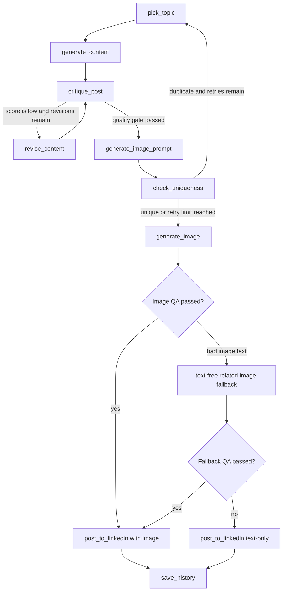

# LinkedIn Post AI

Automated LinkedIn posting pipeline powered by Gemini, Cloudflare Workers AI, LangGraph, and ChromaDB.

It picks a topic, writes a LinkedIn post, self-critiques it, generates a related hand-drawn explainer image, checks the image for spelling and relevance, publishes to LinkedIn, and saves history so future posts do not repeat.

## What It Does

1. Picks a fresh topic from RSS feeds plus evergreen topic lists.
2. Writes a LinkedIn post with Gemini.
3. Critiques the draft and revises weak posts.
4. Generates an image prompt using one of 15 rotating visual directions.
5. Creates a LinkedIn-style hand-drawn comic/explainer image with Cloudflare Workers AI.
6. Checks image text and topic relevance with Gemini Vision.
7. If text in the image is misspelled, retries with simpler text.
8. If text still fails, tries a fully related text-free image.
9. If image generation still fails QA, posts text-only instead of stopping the run.
10. Publishes to LinkedIn and stores post history.

## Project Structure

```text
LinkedIn_Post_AI/
|-- linkedin_pipeline.py              # Main LangGraph pipeline
|-- post_prompts.py                   # Topics, content prompts, image prompts, QA prompt
|-- linkedin_poster.py                # LinkedIn OAuth, image upload, post creation
|-- requirements.txt                  # Python dependencies
|-- posts_history.json                # Git-friendly post history for duplicate checks
|-- images/                           # Generated images, git-ignored
|-- post_history_db/                  # ChromaDB local store, git-ignored
|-- .env.example                      # Optional local env template
|-- .github/workflows/auto_post.yml   # GitHub Actions scheduler
`-- GITHUB_ACTIONS_SETUP.md           # Optional cloud setup notes
```

## Pipeline Flow

<div align="center">



</div>

## Pipeline Nodes

| Node | Purpose |
|---|---|
| `pick_topic` | Picks a topic from RSS titles plus evergreen lists. |
| `generate_content` | Calls Gemini with `content_prompt(topic)`. |
| `critique_post` | Scores the post and adds deterministic penalties for cliches, missing hashtags, or too few emojis. |
| `revise_content` | Rewrites the post using critic feedback. |
| `generate_image_prompt` | Rotates through 15 visual directions and asks Gemini for a topic-specific image prompt. |
| `check_uniqueness` | Uses ChromaDB similarity against previous posts. |
| `generate_image` | Calls Cloudflare Workers AI and runs Gemini Vision QA. |
| `post_to_linkedin` | Posts with image if QA passed, otherwise posts text-only. |
| `save_history` | Appends post text to `posts_history.json` and ChromaDB. |

## Image System

The image system is designed for LinkedIn-style explainers, not generic stock photos.

`post_prompts.py` contains 15 rotating visual templates in `VISUAL_DIRECTIONS`. Gemini picks one direction per run and then writes a topic-specific Cloudflare image prompt.

Template examples include comic panels, mistake-to-fix stories, two-character dialogue, bridge sketches, before/after sketches, whiteboard maps, roadmaps, workbench scenes, investigation boards, and control-room review scenes.

The rotation is deterministic, based on post history and retry state, so consecutive posts are encouraged to look different. Edit `VISUAL_DIRECTIONS` if you want to add, remove, or rename image styles.

## Image QA And Fallbacks

Image generation follows this order:

1. Generate a hand-drawn explainer with 2-4 short labels or speech bubbles.
2. Gemini Vision transcribes visible text and checks spelling, grammar, legibility, duplicates, layout, and topic relevance.
3. If QA fails, retry with fewer and simpler text fragments.
4. If labeled images keep failing, generate a text-free image that still clearly shows the topic.
5. If that also fails, publish the LinkedIn post without an image.

This avoids posting images with misspellings like `WORKOWK`, `EXECUUTE`, or unrelated visuals.

## Models

Text generation:

- `gemini-3.6-flash`
- `gemini-3.1-flash-lite` fallback

Image generation:

- `@cf/black-forest-labs/flux-2-klein-4b`
- `@cf/black-forest-labs/flux-2-dev`
- `@cf/black-forest-labs/flux-1-schnell`
- `@cf/stabilityai/stable-diffusion-xl-base-1.0`

## Quick Start

Clone the repository:

```bash
git clone https://github.com/DharamVeer970/LinkedIN_Post_Automation.git
cd LinkedIN_Post_Automation
```

Create and activate a virtual environment:

```bash
python -m venv .venv

# Windows
.venv\Scripts\activate

# Linux/Mac
source .venv/bin/activate
```

Install dependencies:

```bash
pip install --upgrade pip
pip install -r requirements.txt
```

Create `.env` in the project root:

```text
GEMINI_API_KEY=your_gemini_key
LINKEDIN_TOKEN=your_linkedin_access_token
CLOUDFLARE_ACCOUNT_ID=your_cloudflare_account_id
CLOUDFLARE_API_KEY=your_cloudflare_workers_ai_token
CLIENT_ID=your_linkedin_client_id
CLIENT_SECRET=your_linkedin_client_secret
```

Run LinkedIn OAuth once if you do not already have `LINKEDIN_TOKEN`:

```bash
python linkedin_poster.py
```

Run the full pipeline:

```bash
python linkedin_pipeline.py
```

Generated images are saved in `images/`.

## Environment Variables

| Variable | Required | Purpose |
|---|---:|---|
| `GEMINI_API_KEY` | yes | Gemini text generation and Gemini Vision QA |
| `LINKEDIN_TOKEN` | yes | LinkedIn posting token |
| `CLOUDFLARE_ACCOUNT_ID` | yes | Cloudflare account ID for Workers AI |
| `CLOUDFLARE_API_KEY` | yes | Cloudflare API token with Workers AI access |
| `CLIENT_ID` | once | LinkedIn OAuth setup |
| `CLIENT_SECRET` | once | LinkedIn OAuth setup |

## Cloudflare Token

Create an API token in Cloudflare with Workers AI access.

Common failures:

- `401` or `403`: token is wrong or missing permission.
- `7003` or `7000`: account ID is wrong.
- Daily neuron limit: wait for reset or upgrade Cloudflare plan.

## LinkedIn Token

`linkedin_poster.py` handles the one-time OAuth flow.

The token expires, so if posting starts failing with authorization errors, rerun:

```bash
python linkedin_poster.py
```

Then update `.env` and GitHub Secrets.

## GitHub Actions Scheduling

The workflow lives at:

```text
.github/workflows/auto_post.yml
```

For a full cloud setup walkthrough, refer to [`GITHUB_ACTIONS_SETUP.md`](GITHUB_ACTIONS_SETUP.md).

It runs daily at 09:00 UTC, then checks:

```bash
day_of_year % 4 == 0
```

That gives a true every-4-days cadence. You can also run it manually with `workflow_dispatch`.

Required GitHub Secrets:

```text
GEMINI_API_KEY
LINKEDIN_TOKEN
CLOUDFLARE_ACCOUNT_ID
CLOUDFLARE_API_KEY
```

The workflow commits `posts_history.json` back to the repo so duplicate detection survives fresh GitHub Actions runners.

## Customization

Edit `post_prompts.py` for:

- `TOPIC_DOMAINS`: RSS feeds and evergreen topic lists.
- `content_prompt()`: LinkedIn writing style.
- `critique_prompt()`: post quality rules.
- `image_prompt_gen()`: image prompt behavior.
- `VISUAL_DIRECTIONS`: the 15 rotating image styles.
- `image_qa_prompt()`: spelling, layout, and relevance checks.

Edit `linkedin_pipeline.py` for:

- `GEMINI_MODELS`
- `QUALITY_GATE`
- `MAX_REVISIONS`
- `MAX_RETRIES`
- `CF_MODELS`
- `IMAGE_QA_MAX_ATTEMPTS`
- `TEXT_FREE_IMAGE_ATTEMPTS`
- image fallback behavior

Edit `linkedin_poster.py` only if LinkedIn API payloads or API versions change.

## Local Checks

Syntax check:

```bash
python -m py_compile linkedin_pipeline.py post_prompts.py linkedin_poster.py
```

Safe import check:

```bash
python -W default -c "import linkedin_pipeline; print('ok')"
```

Full run posts to LinkedIn, so only run this when you are ready:

```bash
python linkedin_pipeline.py
```

## Troubleshooting

| Symptom | Fix |
|---|---|
| `GEMINI_API_KEY` or `LINKEDIN_TOKEN` missing | Check `.env` locally or GitHub Secrets in Actions. |
| Gemini `429` | Wait for quota reset or rely on model fallback. |
| Cloudflare `401/403` | Recreate token with Workers AI access. |
| Cloudflare `7003/7000` | Copy the correct Cloudflare account ID. |
| Image text is misspelled | Pipeline retries, then switches to text-free image. |
| Image is still unrelated or bad | Pipeline posts text-only. |
| LinkedIn token expired | Rerun `python linkedin_poster.py`. |
| ChromaDB empty in Actions | Commit `posts_history.json`; ChromaDB is rebuilt from it. |
| Warning about `allowed_objects` | Suppressed in `linkedin_pipeline.py`. |

## Git Notes

Keep these out of git:

```text
.env
images/
post_history_db/
```

Keep this in git:

```text
posts_history.json
```

`posts_history.json` is what lets scheduled GitHub Actions runs remember previous posts.
